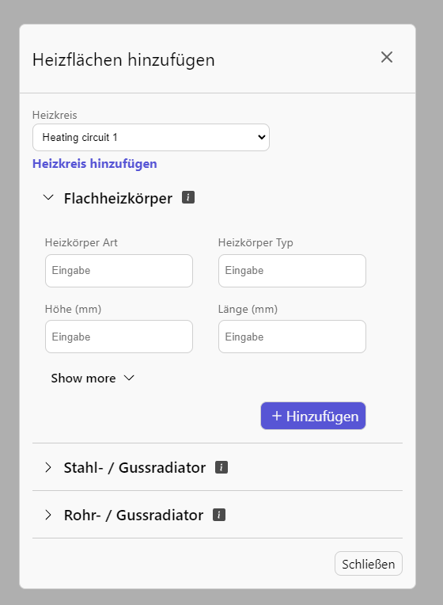

# Design engineering example

## Part 1
[src/AddHeating.tsx](src/AddHeating.tsx) + [src/components/Modal.tsx](src/components/Modal.tsx)

## Part 2

[src/components/Assistant.tsx](src/components/Assistant.tsx)

